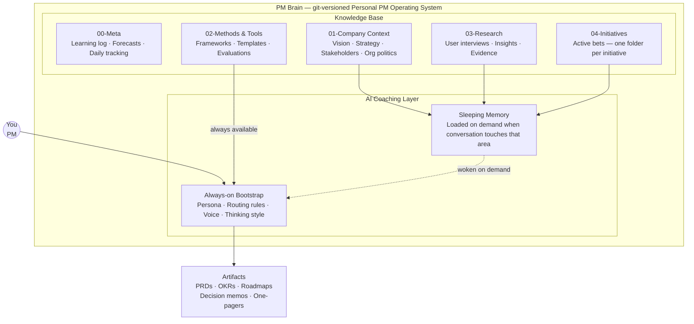
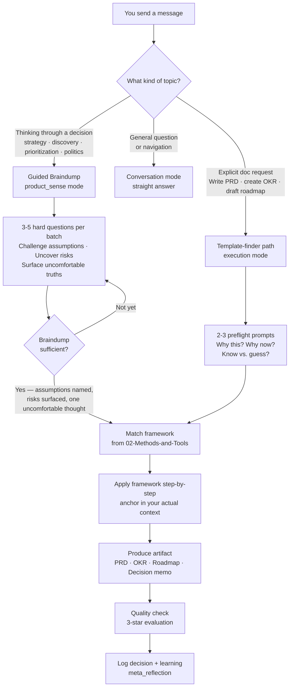
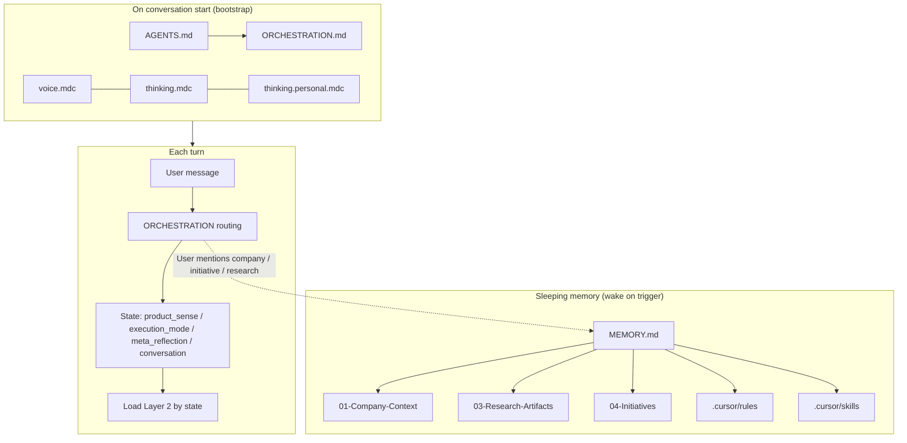
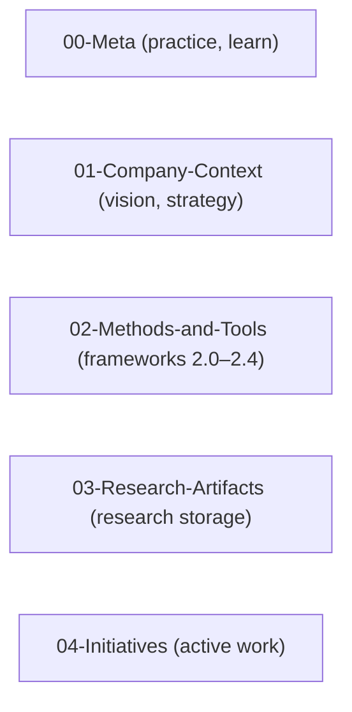
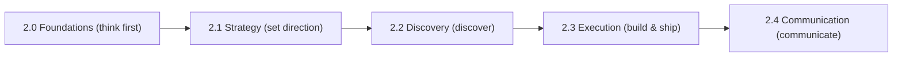
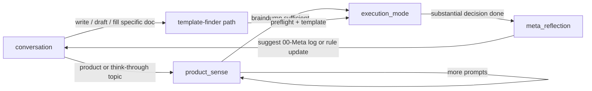
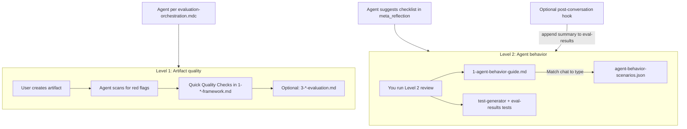
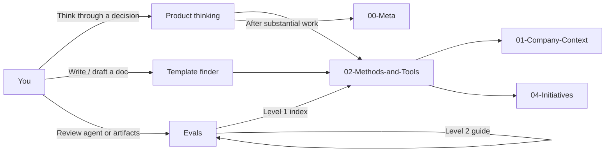
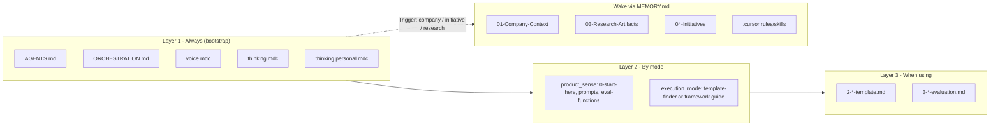

# PM Brain – Architecture Overview

**What this file is:** Short visual reference for repo structure and methods flow. **This is documentation for humans (and for agents when they need a system overview); it is not executed behavior.** Executed behavior lives in [ORCHESTRATION.md](..\/ORCHESTRATION.md). For full navigation: [README.md](..\/README.md), [AGENTS.md](..\/AGENTS.md), [ORCHESTRATION.md](..\/ORCHESTRATION.md), [MEMORY.md](..\/MEMORY.md). For a short reference summary (not loaded by the agent): [agent-manifest.md](agent-manifest.md). For product thinking: [0-start-here-product-thinking.md](..\/02-Methods-and-Tools/2.0-Foundations/2.0.1-Mental-Models/6-Product-Sense-Development/0-start-here-product-thinking.md). For “I need a template”: [0-template-finder.md](..\/02-Methods-and-Tools/0-template-finder.md). For “everything about topic X”: [1-frameworks-by-topic.md](..\/02-Methods-and-Tools/1-frameworks-by-topic.md). For evals (methods + agent behavior): [.cursor/evals/README.md](..\/.cursor/evals/README.md).

**Preview:** The built-in Markdown preview in Cursor (and VS Code) does not render Mermaid diagrams by default. To see flowcharts and diagrams in preview, install a Mermaid-capable extension (e.g. **Markdown Preview Mermaid Support** or **Mermaid Preview** from the Extensions view). Diagrams in this file also render on GitHub and in online Mermaid editors.

---

## At a glance

Two diagrams that explain the whole system. Useful for onboarding someone new or explaining what this is.

**What PM Brain is — structure:**

**How a coaching session flows:**

**The short pitch:** A personal PM knowledge base with a built-in thinking coach. Every conversation is grounded in your actual company context, uses a curated library of PM frameworks, and pushes you to think clearly before producing polished docs.

---

## Design Principles

This section documents **why** the repo is structured this way. Use it when evaluating structural changes (e.g. adding root files, moving agent config, refactoring).

### Root file policy

- **Root is reserved for:** (a) files AI platforms expect at root by convention (AGENTS.md, CLAUDE.md), (b) core orchestration the agent loads at startup (ORCHESTRATION.md, MEMORY.md), (c) Layer 2 specs loaded on-demand (PRODUCT-SENSE-RULES.md), and (d) project metadata not loaded at startup (version.json).
- **Human documentation** goes in `docs/`, not at root.
- Adding a new root file requires justification against these criteria.

### Loading layer rationale

- **Layer 1** (bootstrap) is the 5-file set loaded unconditionally at conversation start. Keep it as lean as possible — every line here costs context on every conversation regardless of topic.
- A file belongs in Layer 1 only if the agent needs it on **every** turn. Everything else is Layer 2+ (on-demand).
- Example: PRODUCT-SENSE-RULES.md is Layer 2 because it is only needed in product_sense state — putting it in Layer 1 would waste context on every non-product conversation.

### Separation of concerns

- **AGENTS.md** = WHO (persona, pointers) — slim, Layer 1.
- **ORCHESTRATION.md** = WHAT (routing, states, loading) — Layer 1.
- **MEMORY.md** = WHERE (sleeping memory, path mapping) — consulted on trigger.
- **PRODUCT-SENSE-RULES.md** = HOW the golden rule works (full spec) — Layer 2.
- Each file has one job; if you cannot describe it in one sentence, consider splitting.

### Platform agnosticism

- AGENTS.md at root is a cross-platform convention (Cursor, Claude Code, GitHub Copilot).
- CLAUDE.md at root is a Claude Code requirement (auto-discovered).
- Platform-specific paths are routed through MEMORY.md, never hardcoded in AGENTS.md or ORCHESTRATION.md.
- Any structural change must work on Cursor **and** Claude Code without extra configuration.

### Platform-specific wiring

Each platform has a different auto-load mechanism. The CONTENT is shared (same rules, same persona, same orchestration), but the WIRING — how that content gets into the agent's context — is platform-specific. Don't try to make one folder or one file serve all platforms; instead, create the entry point each platform needs and point it at the shared content.

| Platform | Entry point | What it does |
|----------|------------|-------------|
| **Cursor** | `.cursor/rules/*.mdc` | Auto-injects rules into every conversation. No read step needed. |
| **VS Code + Copilot** | `.github/copilot-instructions.md` | Auto-loads as system prompt; instructs agent to read shared bootstrap files. |
| **Claude Code** | `CLAUDE.md` | Auto-discovered by Claude; contains manual setup checklist pointing at shared files. |
| **ChatGPT / Claude.ai** | None (manual) | User pastes bootstrap context; see `docs/platform-setup.md`. |

**Principle:** One content set, platform-specific wiring. When adding a new rule or changing agent behavior, update the CONTENT (shared files). When supporting a new platform, create a new ENTRY POINT that wires to the same content. Don't duplicate content across entry points — except for critical guardrails (like the golden rule) that must survive even if the bootstrap is skipped.

### Structural "do nots"

- Do **not** create JSON manifests duplicating the filesystem (they go stale).
- Do **not** pre-declare frameworks as enabled/disabled (fights the repo philosophy).
- Do **not** move agent core files into subdirectories for tidiness (breaks conventions).
- Do **not** merge large Layer 2 files into Layer 1 files (wastes context budget).

### Naming conventions

- **Root:** UPPERCASE for agent/core and former human docs (AGENTS.md, ORCHESTRATION.md, …); README.md; version.json lowercase. New human docs go in `docs/` as lowercase.
- **docs/:** lowercase hyphenated (setup.md, guidelines.md, architecture.md, credits.md, agent-manifest.md).
- **02-Methods-and-Tools:** README.md plus `N-name-with-hyphens.md` (number prefix, lowercase).
- **01-Company-Context:** Entry UPPERCASE (CONTEXT.md, CONTEXT-HEALTH.md); content number-lowercase (1-company-vision.md, …). Setup guide lives in `docs/setup.md`.
- **04-Initiatives:** lowercase (summary.md, prd.md, opportunity-assessment.md, …).
- **00-Meta:** Content lowercase; entry/guide docs may stay UPPERCASE. No UPPERCASE in otherwise lowercase folders — fix outliers.
- **.cursor:** lowercase hyphenated for rules/skills (voice.mdc, product-sense.mdc).

---

## System overview (how the agent runs)

High-level flow: the agent loads a small core at conversation start, infers state from your message, and loads more context only when needed. Sleeping memory is woken only when the conversation touches that area.

**In words:**
- **Start (bootstrap):** Agent reads the 5-file bootstrap set: AGENTS.md (persona), ORCHESTRATION.md (routing and modes), voice.mdc (communication style), thinking.mdc (coaching behavior), and thinking.personal.mdc (personal context). No other files are loaded yet.
- **Each turn:** Your message is matched against ORCHESTRATION's decision tree → one mode is chosen (product_sense, execution_mode, meta_reflection, or conversation). The agent then loads only the Layer 2 files for that mode (e.g. 0-start-here + prompts for product_sense; template-finder + framework for execution_mode).
- **Cross-cutting behaviors:** Some rules fire in ANY state, regardless of mode: the Product Judgment Test capture trigger (decision with confidence → offer PJT), intent disambiguation (clarify ambiguous topic signals before loading), and the company context routing guard (check CONTEXT-HEALTH.md before suggesting updates to company docs).
- **Sleeping memory:** 01-Company-Context, 03-Research-Artifacts, 04-Initiatives, and .cursor (conditional rules, skills) are **not** in the prompt until the conversation touches them. When you mention strategy, an initiative, or research, the agent consults MEMORY.md and loads the relevant paths. This keeps the prompt small and focused.

---

## Repo layers

The repo has five main folders at the top level. Each holds a different kind of content. The diagram below shows them side by side; the list and table follow.

**Visual:**

**The five folders:**

- **00-Meta** — practice, learning log, growth portfolio, Product Judgment Test  
- **01-Company-Context** — vision, strategy, stakeholders  
- **02-Methods-and-Tools** — frameworks, guides, templates (2.0–2.4)  
- **03-Research-Artifacts** — research storage  
- **04-Initiatives** — active work, one folder per bet  

| Area | Purpose |
|------|---------|
| **00-Meta** | What you *do* and *learn* — daily log, learning log, growth portfolio, Product Judgment Test. Canonical prompts/templates live in 6-Product-Sense-Development. |
| **01-Company-Context** | Your company’s direction and constraints. Customize; keep current. |
| **02-Methods-and-Tools** | Reusable frameworks (2.0–2.4). Flow below. |
| **03-Research-Artifacts** | Research storage. Link to initiatives. |
| **04-Initiatives** | One folder per bet; day-to-day product work. |

---

## Methods flow (02-Methods-and-Tools)

Inside `02-Methods-and-Tools/` you work in this order: **think** (Foundations) → **set direction** (Strategy) → **discover** (Discovery) → **build and ship** (Execution), while **communicating** all along (Communication). The diagram below shows the flow; the table follows.

**Visual (flow, left to right):**

**Flow (text):** `2.0 Foundations` → `2.1 Strategy` → `2.2 Discovery` → `2.3 Execution` → `2.4 Communication`

| Layer | Contents |
|-------|----------|
| **2.0 Foundations** | Think first — product sense entry, mental models, bias. Start here before templates. |
| **2.1 Strategy** | Direction, goals, roadmap, prioritization. |
| **2.2 Discovery** | Research, JTBD, opportunity assessment, idea validation. |
| **2.3 Execution** | PRDs, personas, metrics, execution rituals. |
| **2.4 Communication** | Stakeholder communication, one-pagers, crisis, escalation, saying no. |

---

## Agent mode flow (state diagram)

The assistant operates in four **modes**: **product_sense**, **execution_mode**, **meta_reflection**, and **conversation**. The template-finder path is an **entry path** into execution_mode (when the user asks to write/draft/fill a specific doc), not a separate mode.

- **conversation** (default): General questions, navigation, non-product topics. When the user message matches product or doc-request triggers, re-route using the decision tree in [ORCHESTRATION.md](..\/ORCHESTRATION.md).
- **product_sense**: Entered when the topic is product/stakeholder/organization/strategy/roadmap/prioritization/discovery/execution or "help me think through something". Stay here while you braindump using prompts from `2-product-sense-prompts.md` and the golden rule in `PRODUCT-SENSE-RULES.md`, until the "braindump sufficient" checklist is met.
- **Template finder path** (entry into execution_mode): When you ask to write/draft/fill a specific doc (PRD, OKR, one-pager, etc.), use [0-template-finder.md](..\/02-Methods-and-Tools/0-template-finder.md) to jump to the right README + template, with 1–2 preflight prompts for non-trivial docs.
- **execution_mode**: After sufficient braindump (or via template-finder path), help structure thinking and apply the right framework/template from `02-Methods-and-Tools/`.
- **meta_reflection**: After substantial decision work, suggest logging in `00-Meta/` (forecast log, learning log, pattern recognition), optionally running the Level 2 checklist ([.cursor/evals/1-agent-behavior-guide.md](..\/.cursor/evals/1-agent-behavior-guide.md)), and optionally updating rules (see `.cursor/rules/thinking.mdc`). Exit → return to **conversation**.

**Evals** are a separate workflow (see Evaluation system below), not a conversation mode. The agent may suggest the Level 2 checklist in meta_reflection; you run evals when you choose.

---

## Cross-cutting behaviors (fire in any state)

Some agent behaviors are **unconditional** — they fire regardless of which mode the agent is in. These are defined in [ORCHESTRATION.md](..\/ORCHESTRATION.md) → Cross-Cutting Behaviors:

- **Product Judgment Test capture:** Any time a decision is captured with an explicit confidence level (anywhere, any state), the agent immediately offers to log it in the [Product Judgment Test](..\/00-Meta/0.3-Product-Judgment-Test/forecast-log.md). This is hardcoded, not a judgment call.
- **Intent disambiguation:** When a topic signal is ambiguous (e.g. "roadmap" could mean "load company roadmap" or "help me build a roadmap"), the agent states its interpretation and checks before loading — one brief confirmation, not an interrogation.
- **Company context routing guard:** Before suggesting an update to any numbered company context doc, the agent checks [CONTEXT-HEALTH.md](..\/01-Company-Context/CONTEXT-HEALTH.md) for its Maintained/Reference/External status. Reference or External docs route findings to initiative context instead. Stakeholder Avatars are always Maintained.

---

## Evaluation system (evals)

Evals are **guidance-based** (no scripts). Two levels: (1) **Level 1** = artifact quality (methods/frameworks) — lives in `02-Methods-and-Tools/` (Quick Quality Checks in `1-*-framework.md`, full review in `3-*-evaluation.md`); (2) **Level 2** = agent behavior — lives in `.cursor/evals/` ([1-agent-behavior-guide.md](..\/.cursor/evals/1-agent-behavior-guide.md), [2-checklist.md](..\/.cursor/evals/2-checklist.md), [agent-behavior-scenarios.json](..\/.cursor/evals/agent-behavior-scenarios.json), [`test-generator.md`](..\/.cursor/evals/test-generator.md), and seeded tests in `eval-results/`). You run evals when it matters; when you learn something new, you update the right file (see "Where to update" in the evals guide).

**How evals are used (visual):**

- **Level 1 during creation:** The agent uses Quick Quality Checks automatically per `.cursor/rules/evaluation-orchestration.mdc` when you work on frameworks with evaluation support (PRD, Opportunity Assessment, North Star, One-Pager, OKR, Roadmap).
- **Level 2:** You (or an AI with the pasteable prompt) run the checklist when you choose; the agent may suggest it after substantial conversations (see [AGENTS.md](..\/AGENTS.md), [ORCHESTRATION.md](..\/ORCHESTRATION.md) → meta_reflection). Scenarios in JSON are reference only—you match your conversation to a scenario type and use success_indicators / failure_modes to score; the agent does not read the JSON. [`test-generator.md`](..\/.cursor/evals/test-generator.md) and `eval-results/test-*-*.md` files give you a library of concrete test conversations.
- **Entry point:** [.cursor/evals/README.md](..\/.cursor/evals/README.md) — intro, separation of evals, how it learns / ask user to adapt, pasteable prompts, file map.
- **Behavior logging and pattern detection:** For optional instrumentation hooks and log format, see [eval-functions.md](..\/.cursor/evals/eval-functions.md), [eval-results/README.md](..\/.cursor/evals/eval-results/README.md), and the post-conversation hook `.cursor/hooks/log-eval.js` (currently disabled in `.cursor/hooks.json`; re-enable when the hook payload is fixed). These enable tracking agent behavior over time for pattern detection (non-blocking).

---

## How the repo is used (entry points and flows)

The repo has a few main entry points. Depending on what you're doing, the agent (or you) routes to the right place. The diagram below shows how those entry points connect to the rest of the repo.

**Where to start (quick reference):**

| I want to... | Go to |
|--------------|-------|
| **Think through a product decision** | [0-start-here-product-thinking.md](..\/02-Methods-and-Tools/2.0-Foundations/2.0.1-Mental-Models/6-Product-Sense-Development/0-start-here-product-thinking.md) — braindump first, then frameworks |
| **I know the doc I need** (PRD, OKR, roadmap, etc.) | [0-template-finder.md](..\/02-Methods-and-Tools/0-template-finder.md) — jump straight to template |
| **Understand the system architecture** | [architecture.md](architecture.md) — visual overview, flows, context management |
| **Configure the agent / orchestration** | [AGENTS.md](..\/AGENTS.md) — persona; [ORCHESTRATION.md](..\/ORCHESTRATION.md) — routing, states, loading; [MEMORY.md](..\/MEMORY.md) — sleeping memory manifest. *These are what the agent loads.* |
| **Quick reference** (not loaded by agent) | [agent-manifest.md](agent-manifest.md) — summary of entrypoints, states, and content clusters; for humans and maintainers only |
| **Run evals** (artifact quality or agent behavior) | [.cursor/evals/README.md](..\/.cursor/evals/README.md) — Level 1 (methods) or Level 2 (agent behavior) |
| **Set up for the first time** | [docs/setup.md](setup.md) — company context, agent config, optional 00-Meta setup |

| Entry point | Trigger | Where it leads |
|-------------|---------|----------------|
| **Product thinking** | You're braindumping, exploring, or asking for help with a decision | [0-start-here-product-thinking.md](..\/02-Methods-and-Tools/2.0-Foundations/2.0.1-Mental-Models/6-Product-Sense-Development/0-start-here-product-thinking.md) → product_sense → then [02-Methods-and-Tools/](..\/02-Methods-and-Tools/README.md) (framework/template). After substantial work, agent may suggest [00-Meta/](..\/00-Meta/README.md) (log, forecast, learning). |
| **Template finder** | You ask to write/draft/fill a specific doc (PRD, OKR, one-pager, etc.) | [0-template-finder.md](..\/02-Methods-and-Tools/0-template-finder.md) → right README + template in 02-Methods-and-Tools. For frameworks with evaluation support, agent uses Quick Quality Checks ([evaluation-orchestration.mdc](..\/.cursor/rules/evaluation-orchestration.mdc)). |
| **Evals** | You want to review artifact quality or agent behavior | [.cursor/evals/README.md](..\/.cursor/evals/README.md) → Level 1 (Methods) or Level 2 (agent-behavior guide, checklist, scenarios as reference). Agent may suggest Level 2 checklist after substantial conversations (meta_reflection). |

---

## Linking Conventions

**Cross-domain references:** Point to domain `README.md` files (e.g., `2.0-Foundations/README.md`, `2.1-Strategy/README.md`). These serve as stable entry points for each domain.

**Within-domain references:** 
- Use sibling links for closely related files (e.g., `1-framework.md`, `2-template.md`)
- Use `../README.md` to reference the domain index
- Use stable paths for nearby subdomains (e.g., `../2.0.2-Bias/README.md`)

**Deep links:** Only use deep links (e.g., `../../2.0-Foundations/2.0.3-Self-Reflection/README.md`) when specifically referencing a particular framework in context, or in "Related frameworks" sections. Prefer domain indices for general navigation.

**Agent guidance placement:** "For Agents" sections (agent-facing instructions on when/how to suggest frameworks) must appear **at the very top** of the document so the agent sees them first (avoids lost-in-middle and ensures consistent behavior). Convention:
- **If a framework folder has `1-*-framework.md`:** Place "For Agents" section in `1-*-framework.md` at the top (immediately after the main title and optional one-line description). The folder `README.md` serves as human-facing index/navigation only.
- **If a framework folder does NOT have `1-*-framework.md`:** Place "For Agents" section in the folder `README.md` at the top (after the main title).

This keeps agent-facing instructions visible first when the file is loaded; human-facing content (overview, methodology, templates) follows below.

**When adding new frameworks:** Follow these conventions to maintain consistent navigation patterns.

---

## Context Management Strategy

The agent loads different files at different times to stay within context limits. **Definitive loading logic:** [ORCHESTRATION.md](..\/ORCHESTRATION.md) → Context Loading Strategy. **Sleeping memory manifest:** [MEMORY.md](..\/MEMORY.md).

**Visual (what gets loaded when):**

**Three layers, short version:**
- **Layer 1 (bootstrap):** 5 files loaded unconditionally at conversation start (AGENTS, ORCHESTRATION, voice, thinking, thinking.personal). No response before these are loaded. Platform wiring determines how (see Design Principles → Platform-specific wiring above).
- **Layer 2 (by mode):** Loaded when a mode is entered — product_sense gets entry point + prompts + eval-functions; execution_mode gets template-finder or framework guide.
- **Layer 3 (reference):** Templates (`2-*-template.md`) and evaluations (`3-*-evaluation.md`) loaded only when actively filling or checking.
- **Sleeping memory:** Company context, research, initiatives, conditional rules (`.cursor/rules/`), and skills (`.cursor/skills/`) load only when the conversation touches that area — triggered by user message, routed via MEMORY.md.

For the full file-by-file loading table, see [ORCHESTRATION.md](..\/ORCHESTRATION.md) → Context Loading Rules.

**For framework authors:** Keep framework guides focused. Put detailed examples in separate files. Keep "For Agents" sections concise.

### Context Health (Preventing Rot)

Long conversations degrade quality as context fills up. The agent uses heuristic triggers (heavy context loaded, state transitions, ~25-30 turn ceiling) to offer **checkpoints** — saving session state to `checkpoints/session-*.md` so the user can continue in a fresh conversation. Re-anchoring happens silently at state transitions. Full protocol: [ORCHESTRATION.md](..\/ORCHESTRATION.md) → Context Health.

---

## Version Management

Version tracking uses semantic versioning in `version.json` (repo root). See [guidelines.md](guidelines.md) → Version Management for when and how to update. `version.json` is **sleeping memory** — not loaded at bootstrap. The agent wakes it on demand when the user asks about version or recent changes, or when bumping after structural work. See [ORCHESTRATION.md](../ORCHESTRATION.md) → Version Management.
